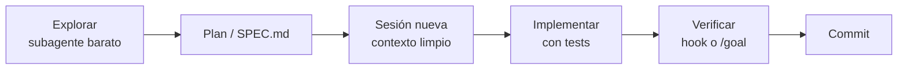

# Optimización de tokens con agentes de IA en repositorios de millones de líneas

Sep 24, 2026 · @Arturo

## Resumen ejecutivo

Lo que más ahorra es controlar qué entra en la ventana de contexto, no instalar compresores. Las cinco palancas con mejor relación impacto/esfuerzo:

1. Sesiones cortas: `/clear` entre tareas y sin cambiar modelo ni esfuerzo a mitad de tarea (preserva la caché).
2. CLAUDE.md/AGENTS.md mínimos, escritos a mano y divididos por paquete.
3. Exploración y salidas largas en subagentes baratos.
4. Reglas `Read` deny para código generado, compilado y vendorizado.
5. LSP para navegar por símbolos en C/C++/Java y refactors.

Los compresores de la comunidad rinden muy por debajo de lo anunciado: rtk no ahorró nada en tareas reales y caveman ahorró un 8,5 % frente al 65 % prometido. Tool search (carga diferida de MCP) reduce un 85 % los tokens de definiciones, pero se rompe con proxies no oficiales.

### Niveles de evidencia

| Etiqueta | Significado |
| --- | --- |
| Oficial | Documentación o blog de ingeniería del proveedor |
| Empírica | Benchmark o estudio con metodología publicada |
| Comunidad | Opiniones o cifras autodeclaradas sin metodología controlada |

## 1. Gestión de contexto e instrucciones

El contexto es el recurso limitante: cada turno reenvía todo el historial, y el rendimiento se degrada al llenarse la ventana (Oficial).

### 1.1 Archivos de instrucciones jerárquicos

- **Carga jerárquica (Oficial):** Claude Code carga el CLAUDE.md del directorio de trabajo y sus ancestros al arrancar, y el de cada subdirectorio cuando lee archivos allí. Raíz navegacional con reglas globales; un archivo por paquete con su stack.
- **Arranque acotado (Oficial):** `cd packages/api && claude` limita acceso y contexto a ese subárbol.
- **Exclusiones (Oficial):** `claudeMdExcludes` evita cargar CLAUDE.md ajenos; `.claude/rules/` con `paths:` es la alternativa centralizada.
- **Tamaño (Oficial):** menos de \~200 líneas; `/doctor` propone recortes. Los comentarios HTML no se inyectan (Comunidad).
- **Evidencia (Empírica):** según ETH Zurich (arXiv:2602.11988), los archivos de contexto no mejoran el éxito en general y suben el coste de inferencia más de un 20 %; los generados por LLM restan \~3 % de éxito y los escritos por humanos suman \~4 %. Otro estudio (arXiv:2601.20404) midió −28,64 % de tiempo y −16,58 % de tokens de salida.

### 1.2 Skills con carga progresiva

- Solo el nombre y la descripción de cada skill están siempre en contexto; el cuerpo se carga al invocarse (Oficial).
- Mueva flujos específicos (migraciones, despliegue, tests de un paquete) de CLAUDE.md a skills por paquete o con `paths:`.
- Descripciones cortas que empiecen por las palabras que usaría una petición.

### 1.3 Subagentes para aislar exploración

- Corren en su propia ventana y devuelven un resumen (Oficial).
- Defina subagentes con `model: haiku` o `sonnet` y herramientas de solo lectura para abaratar.
- Cuidado: los agent teams consumen \~7x más tokens que una sesión estándar en plan mode.

### 1.4 Plan mode y especificidad

- Plan mode separa explorar de ejecutar; sáltelo si el diff cabe en una frase (Oficial).
- Las peticiones vagas provocan escaneos amplios; las específicas (archivo + cambio concreto) minimizan lecturas.

## 2. Sesiones, compactación y caché de prompts

Elija modelo y esfuerzo al inicio de la sesión y no los cambie a mitad de tarea: la caché exige coincidencia exacta de prefijo (Oficial).

### 2.1 Comandos de sesión

| Comando | Cuándo usarlo |
| --- | --- |
| `/clear` | Entre tareas no relacionadas, o tras corregir lo mismo más de dos veces |
| `/compact <instrucciones>` | Continuar la misma tarea con foco |
| `/rewind` → Summarize | Compactar solo una parte del historial |
| `/btw` | Preguntas laterales que no entran en el historial |
| `/autocompact 500k` | Bajar el umbral en ventanas de 1M para evitar sesiones gigantes |

Compactar tras una pausa mayor que el TTL reprocesa todo sin caché: compacte en pausas naturales entre tareas.

### 2.2 Qué invalida la caché

Cambiar de modelo (incluido `opusplan` al alternar plan mode), cambiar el esfuerzo, activar fast mode, conectar o desconectar MCP, activar o desactivar plugins con MCP, compactar, acumular imágenes y actualizar Claude Code.

### 2.3 TTL de la caché

| Contexto | TTL |
| --- | --- |
| Conversación principal en suscripción | 1 hora |
| API key, proveedores cloud o créditos | 5 minutos (configurable a 1 h con `promptCacheTtl`) |
| Subagentes | 5 minutos; no leen la caché del padre (los forks sí) |

### 2.4 Context editing y memoria

- En la API, context editing elimina resultados de herramientas antiguos al acercarse al límite (Oficial).
- En una evaluación interna de 100 turnos redujo tokens un 84 %; con la herramienta de memoria mejoró el rendimiento un 39 %.
- Patrón manual equivalente: volcar el progreso a `PLAN.md`, `/clear` y retomar.

## 3. Proceso de desarrollo

El flujo recomendado por Anthropic es explorar, planificar, implementar y hacer commit, con una verificación ejecutable como oráculo (Oficial).



Cada fase empieza con el contexto justo; la spec es el puente entre la sesión de exploración y la de implementación.

### 3.1 Specs y verificación

- Para funcionalidades grandes, Claude le entrevista, escribe `SPEC.md` y se implementa en una sesión nueva (Oficial).
- Buenas specs: nombran archivos e interfaces, declaran lo que queda fuera de alcance y terminan con una verificación end-to-end.
- Verificación de más a menos rigor: Stop hook que bloquea el fin de turno, condición `/goal`, subagente verificador, petición en el prompt.
- TDD: tests que fallan → commit → implementar sin tocar los tests.

### 3.2 Trabajo por módulos y paralelo

- `claude --worktree` con `worktree.sparsePaths` hace sparse-checkout solo de lo necesario; `symlinkDirectories` para `node_modules` (Oficial).
- `--add-dir ../shared` o `additionalDirectories` para tareas que cruzan paquetes.
- Sesiones paralelas independientes gastan menos en total que una sesión secuencial que arrastra todo el contexto.

### 3.3 Modo headless

`claude -p "..." --output-format json` para CI y pre-commit, siempre con `--max-budget-usd` para acotar el gasto por ejecución (Oficial).

### 3.4 Casos reales

- **Anthropic, monorepos de millones de líneas (Oficial):** el harness importa tanto como el modelo. Orden: CLAUDE.md, hooks, skills, plugins en marketplace interno, LSP y subagentes. Una empresa desplegó LSP antes del rollout para navegar C/C++ con fiabilidad.
- **ManoMano, 36K líneas de Java (Empírica, un equipo):** para localizar una regla de negocio, Serena costó casi 4 veces más y tardó un 60 % más que Claude Code sin extensiones; para refactors profundos lo consideran imprescindible.

## 4. Recuperación e indexado de código

Ningún método gana siempre: la búsqueda agéntica es el punto de partida y el LSP o la búsqueda semántica compensan solo en ciertos tipos de tarea.

| Enfoque | Cuándo sirve | Cuándo NO | Evidencia |
| --- | --- | --- | --- |
| Búsqueda agéntica (grep/glob/read) | Por defecto; nombres exactos, strings, comentarios | Patrones vagos en repos gigantes sin punto de partida | Oficial: Anthropic abandonó RAG + base vectorial porque la búsqueda agéntica funcionaba mejor |
| LSP (plugins oficiales, Serena) | Referencias, definiciones, refactors, C/C++/Java, modelos pequeños | Localización cuando el símbolo ya se conoce | Empírica: arXiv 2608.13568, +6 % a +118 % de tokens en localización; −26 % con Haiku |
| Búsqueda semántica (Cursor, MCP) | Preguntas conceptuales, repos de más de 1.000 archivos | Índices obsoletos, privacidad, búsquedas exactas | Proveedor: Cursor, +12,5 % de precisión media |
| Repo map (Aider, RepoMapper) | Visión estructural barata en cada turno | Cuando compite con el presupuesto de trabajo | Oficial Aider: tree-sitter + PageRank, 1k tokens por defecto |
| Empaquetado (Repomix) | Análisis puntual de un subárbol | Sesiones de edición (queda obsoleto) | Comunidad: `--compress` ≈70 % menos tokens |
| Grafos de código | Análisis de impacto, dependencias | Si exponen decenas de herramientas | Comunidad: cifras autodeclaradas |

### Reglas prácticas

- Instale el plugin LSP de su lenguaje (`/plugin install typescript-lsp@claude-plugins-official`) y diga en CLAUDE.md cuándo usarlo: los modelos prefieren grep por hábito.
- No empaquete el monorepo entero en el contexto.
- Prefiera herramientas que devuelvan la línea referenciada en línea: un `path:line` obliga a lecturas extra.

## 5. Plugins, skills, hooks y servidores MCP

Priorice lo nativo y oficial; valide cualquier herramienta de la comunidad con un A/B en su propio repo antes de adoptarla.

### 5.1 Oficiales (máxima prioridad)

| Herramienta | Qué hace | Evidencia |
| --- | --- | --- |
| Plugins de code intelligence (`claude-plugins-official`) | Go to definition y errores de tipos tras editar | Oficial |
| Hook PreToolUse de filtrado de tests | Añade `grep -A 5 -E '(FAIL\|ERROR\|error:)' \| head -100` a los comandos de test | Oficial: de decenas de miles a cientos de tokens |
| Tool search (`ENABLE_TOOL_SEARCH`) | Difiere las definiciones MCP hasta que se necesitan | Oficial: −85 % de tokens de definiciones |
| CLIs (`gh`, `aws`, `gcloud`) | Sustituyen a servidores MCP equivalentes sin listados de herramientas | Oficial |

No desactive tool search: marque `alwaysLoad` solo lo que use en cada turno y desactive MCP ociosos con `/mcp`. Claude Code avisa si una salida MCP supera 10.000 tokens.

### 5.2 Comunidad (validar antes)

| Herramienta | Promesa | Resultado medido |
| --- | --- | --- |
| rtk | 60–90 % | JetBrains: +7,6 % de coste con esfuerzo bajo, ±0 % con esfuerzo alto |
| caveman (skill) | −65 % | −8,5 % en 86 tareas; Quesma: −5 % con Claude, +5 % con DeepSeek |
| Serena | \~70 % | ManoMano: 4x más caro en consultas; útil en refactors |
| Repomix | \~70 % con `--compress` | Sin A/B independiente |
| ccusage, claude-code-otel | Monitorización | Útiles; no ahorran por sí solos |

### 5.3 Riesgos

- Servidores MCP con muchas herramientas: el MCP de GitHub ocupa \~55.000 tokens en 93 definiciones sin carga diferida.
- Proxies con `ANTHROPIC_BASE_URL`: un issue midió 180,4k tokens de MCP frente a 12,3k con conexión directa.
- Skills y subagentes cuyas descripciones se acumulan (aviso a partir de 15.000 tokens en subagentes).
- Activar o desactivar plugins a mitad de sesión cambia el prefijo de caché.

## 6. Reducción de ruido, modelo y esfuerzo

Los tokens de salida pesan menos que la relectura del contexto: recortar lo que entra rinde más que pedir respuestas telegráficas.

### 6.1 Limitar salidas y lecturas

- Ejecute tests individuales en lugar de la suite completa (Oficial).
- Añada a CLAUDE.md comandos compactos: `pytest -q --tb=short`, `--silent`, `| tail -50`.
- Bloquee lecturas con `permissions.deny`: `Read(./**/dist/**/*)`, `Read(./**/vendor/**/*)`, `Read(./**/*.generated.*)`. Ojo: `grep -r` o `find` por Bash sí entran en esos directorios.
- Delegue logs y suites largas a subagentes.

### 6.2 Modelo por tarea

| Modelo | Uso recomendado |
| --- | --- |
| Opus | Arquitectura y razonamiento multipaso |
| Sonnet | La mayoría del código |
| Haiku | Subagentes de exploración simples |

Cambiar de modelo invalida la caché: decida al inicio de la sesión.

### 6.3 Esfuerzo de razonamiento

- Los tokens de thinking se facturan como salida y pueden ser decenas de miles por petición (Oficial).
- Baje `/effort` en tareas simples; en modelos con presupuesto fijo, `MAX_THINKING_TOKENS=8000`.
- En el benchmark de JetBrains, el esfuerzo alto eliminó la penalización de rtk: esfuerzo y número de turnos interactúan (Empírica).

## 7. Medición, monitorización y presupuestos

La referencia oficial es de unos 13 $ por desarrollador y día activo (150–250 $ al mes; menos de 30 $ al día para el 90 % de los usuarios).

### 7.1 Herramientas de medición

| Nivel | Herramienta | Qué muestra |
| --- | --- | --- |
| Sesión | `/usage` | Coste estimado, tokens por modelo, % servido desde caché y causa de los misses |
| Sesión | `/context` | Qué ocupa la ventana: memoria, MCP, skills |
| Sesión | Status line | `context_window.used_percentage` en tiempo real |
| Histórico | `/insights` | Fricciones en hasta 200 sesiones |
| Histórico local | `npx ccusage daily\|session\|blocks` | Consumo sobre los JSONL locales (Comunidad) |
| Organización | OpenTelemetry (`CLAUDE_CODE_ENABLE_TELEMETRY=1`) | `claude_code.token.usage` hacia Grafana, Datadog o CloudWatch |
| Organización | `OTEL_LOG_TOOL_DETAILS=1` | Qué skills se activan, para podar las que no se usan |

### 7.2 Presupuestos

1. Haga un piloto partiendo de la referencia oficial.
2. Fije `--max-budget-usd` en headless y CI.
3. Configure límites de gasto por workspace y organización.
4. Asigne TPM por usuario según el tamaño del equipo (p. ej. 15k–20k para 100–500 usuarios).
5. Cree alertas OTel para sesiones con baja tasa de caché o contexto por encima del 50 %.

En planes Pro/Max/Team el dólar de `/usage` es orientativo: lo que cuenta son los límites de 5 horas y semanal.

## 8. Comparativa con otros asistentes

Todos convergen en los mismos principios; lo que cambia es el mecanismo de recuperación y las palancas de ahorro disponibles.

| Herramienta | Archivo de instrucciones | Compactación | Recuperación | Particularidades de ahorro |
| --- | --- | --- | --- | --- |
| Claude Code | CLAUDE.md jerárquico, rules, skills | `/compact`, auto, `/rewind` | Agéntica + plugins LSP + MCP | Tool search, subagentes, hooks, sparse worktrees |
| OpenAI Codex CLI | AGENTS.md (32 KiB, override) | `/compact` | Agéntica (grep) | `model_reasoning_effort` por agente; dividir AGENTS.md antes que subir el límite |
| Gemini CLI | GEMINI.md jerárquico | `/compress` | Agéntica | GEMINI.md estable = más aciertos de caché implícita; se reinyecta en cada prompt |
| Cursor | AGENTS.md / rules | Automática | Embeddings propios + grep | Índice semántico, +12,5 % de precisión |
| Aider | Archivos de convenciones | Resumen de historial | Repo map tree-sitter/PageRank | `--map-tokens`, modo architect, `/tokens` |
| Cline/Roo, Copilot agent, Amp | AGENTS.md y equivalentes | Variable | Agéntica/semántica | Verifique la carga diferida de MCP en cada cliente |

## 9. Plan de acción y configuraciones

Empiece por las acciones 1–6: impacto alto, esfuerzo bajo y respaldo oficial.

| # | Acción | Categoría | Impacto | Esfuerzo | Evidencia |
| --- | --- | --- | --- | --- | --- |
| 1 | `/clear` entre tareas; sesión nueva por spec; sin cambiar modelo ni esfuerzo | 2 | Alto | Muy bajo | Oficial |
| 2 | Podar CLAUDE.md raíz y dividirlo por paquete; `claudeMdExcludes` | 1 | Alto | Bajo | Oficial + Empírica |
| 3 | `permissions.deny` de `Read` para build, vendor y generados | 6 | Alto | Bajo | Oficial |
| 4 | Exploración y logs en subagentes Sonnet/Haiku de solo lectura | 1 | Alto | Bajo | Oficial |
| 5 | Tool search activo, sin proxies que lo rompan; CLIs antes que MCP | 5 | Alto | Bajo | Oficial |
| 6 | Hook de filtrado de tests y comandos acotados | 5 | Medio-alto | Bajo | Oficial |
| 7 | Plugin LSP + regla "LSP para símbolos, grep para literales" | 4 | Alto en C/C++/Java | Medio | Oficial + Empírica |
| 8 | Specs en archivo y flujo explore-plan-code-commit | 3 | Medio-alto | Medio | Oficial |
| 9 | OTel + ccusage + presupuestos | 7 | Habilita el resto | Medio | Oficial |
| 10 | Skills por paquete con `paths:` y plugin interno | 1 | Medio | Medio | Oficial |
| 11 | Serena, búsqueda semántica o grafos solo tras A/B | 4 | Variable | Medio-alto | Comunidad |
| 12 | No adoptar compresores por su marketing; medir primero | 5 | Bajo | Bajo | Empírica |

### 9.1 `.claude/settings.json` de referencia

```json
{
  "permissions": {
    "deny": [
      "Read(./**/dist/**/*)",
      "Read(./**/build/**/*)",
      "Read(./**/vendor/**/*)",
      "Read(./**/*.generated.*)"
    ]
  },
  "claudeMdExcludes": ["**/packages/legacy-*/**"],
  "worktree": {
    "sparsePaths": [".claude", "packages/api", "packages/shared"],
    "symlinkDirectories": ["node_modules"]
  },
  "enabledPlugins": {
    "typescript-lsp@claude-plugins-official": true
  },
  "hooks": {
    "PreToolUse": [
      {
        "matcher": "Bash",
        "hooks": [
          { "type": "command", "command": "~/.claude/hooks/filter-test-output.sh" }
        ]
      }
    ]
  },
  "env": {
    "CLAUDE_CODE_ENABLE_TELEMETRY": "1",
    "OTEL_METRICS_EXPORTER": "otlp"
  }
}
```

### 9.2 Subagente explorador (`.claude/agents/explorer.md`)

```markdown
---
name: explorer
description: Read-only codebase exploration. Use for locating code, tracing call sites and summarizing modules.
tools: Read, Grep, Glob
model: haiku
---
Explore only what the question needs. Return file paths, symbol names and a summary under 300 words. Never paste whole files.
```

### 9.3 CLAUDE.md raíz

```markdown
# Build y tests
- Ejecuta scripts desde el directorio del paquete. Tests: `npm test -- <archivo>` (nunca la suite completa salvo que se pida).
# Navegación
- Para definiciones/referencias usa el LSP; para literales y comentarios usa grep.
- Nunca edites packages/*/generated/; ejecuta `npm run codegen`.
# Compactación
- Al compactar conserva la lista de archivos modificados y los comandos de test.
```

## 10. Limitaciones y advertencias

Mida tokens hasta el éxito con la misma tasa de acierto: una técnica que ahorra fallando antes no ahorra nada.

- **Versiones:** varias funciones (TTL configurable, línea de caché en `/usage`, `sparsePaths`, herencia de modelo en Explore) dependen de Claude Code v2.1.2xx; compruébelas en su versión.
- **Cifras de proveedores:** el 84 % de context editing, el 85 % de tool search y el +12,5 % de Cursor son evaluaciones internas.
- **Estudios pequeños:** el de LSP es preliminar (Python/TypeScript); ManoMano es un solo equipo con 36K líneas; los de AGENTS.md usan tareas tipo SWE-bench en Python.
- **Cifras de comunidad:** rtk, Serena, Repomix y token-optimizer son autodeclaradas; el único test controlado (JetBrains) contradice a rtk.

## Fuentes

- [Claude Code: buenas prácticas](https://code.claude.com/docs/en/best-practices)
- [Claude Code: bases de código grandes](https://code.claude.com/docs/en/large-codebases)
- [Claude Code: gestión de costes](https://code.claude.com/docs/en/costs)
- [Claude Code: prompt caching](https://code.claude.com/docs/en/prompt-caching)
- [Anthropic: advanced tool use](https://www.anthropic.com/engineering/advanced-tool-use)
- [Anthropic: context management](https://claude.com/blog/context-management)
- [Anthropic: Claude Code en bases de código grandes](https://claude.com/blog/how-claude-code-works-in-large-codebases-best-practices-and-where-to-start)
- [arXiv 2608.13568: ¿ahorra tokens un language server?](https://arxiv.org/pdf/2608.13568)
- [Cursor: búsqueda semántica](https://cursor.com/blog/semsearch)
- [JetBrains: benchmark de rtk](https://blog.jetbrains.com/ai/2026/07/rtk-claude-code-token-savings/)
- [ManoMano: Claude Code vs Serena en Java](https://medium.com/manomano-tech/project-aegis-benchmarking-ai-agents-and-why-serena-is-our-new-must-have-311673db35dd)
- [Aider: repo map](https://aider.chat/docs/repomap.html)
- [OpenAI Codex: AGENTS.md](https://developers.openai.com/codex/guides/agents-md)
- [Issue: tool search con proxies](https://github.com/nguyenphutrong/quotio/issues/529)
